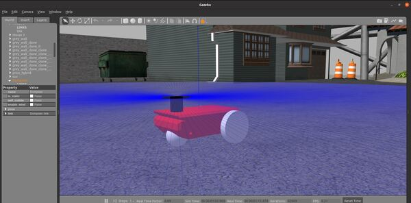
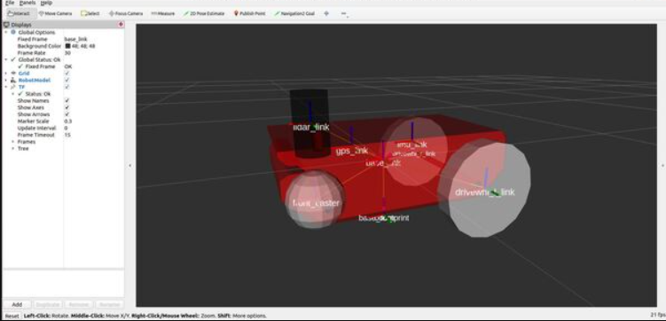
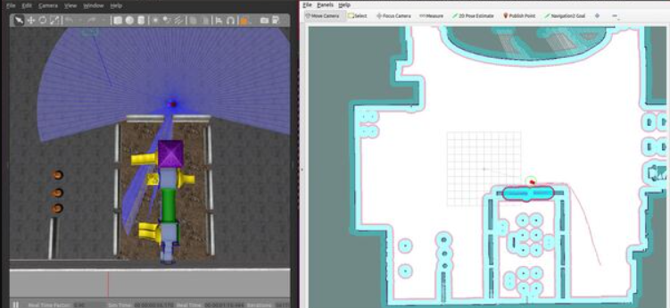

  <h1 align="center">Differential Drive Robot Using Gazebo, ROS2, Rviz, SLAM and Estimated Kalman Filter(EKF)</h1>

  

* Simulated robot with LIDAR and EKF

  

 

* Navigation and SLAM using ROS2 Navigation Stack